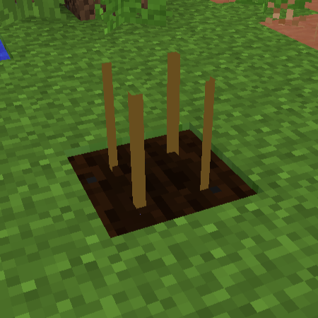

**[目次](../README.md#目次)**

# 作物

耕地にCropを1個(1本？)おくと種や種袋が植えられるようになります。

バイオームや高度、周囲の状況、水やりされているか、肥料を与えられたかどうかなどで成長スピードが決まります。バイオームは湿地かジャングル、高度はY=124が最適です。

水やりや肥料はしばらくしたら効果がなくなるので定期的に水やりしたり肥料を与えたりしてください。

<figure>
    
    <figcaption>設置されたCrop</figcaption>
</figure>

## 作物の例

ここにあげた作物はあくまでも一例です。  
GTNHには様々なIC2作物があり、生育条件が特殊なものもあるので、詳しくは *[ここ](https://gtnh.miraheze.org/wiki/IC2_Crops_List)* を参照してください。

### 鉱石ベリー系

鉱石ベリーからは、インゴットなどの金属に加工できるベリーを収穫することができます。

十分暗い場所(明るさレベル10以下)でのみ成長し、生えている耕地の1ブロック下に対応する金属ブロックがないと最終段階まで成長しません。  
最後まで成長していなくても収穫できます。  
触れるとダメージを受けます。
