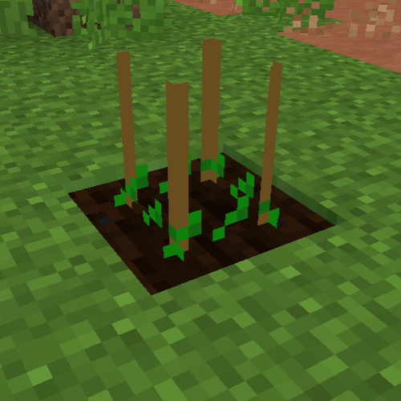

**[目次](../README.md#目次)**

# 雑草

何も植えてない状態でCropを放置すると(1個か2個かにかかわらず)雑草が生えることがあります。

雑草は放置すると周囲のCropに侵食してそこにあった作物を破壊するので、見かけ次第抜く必要があります。

SpadeかWeeding Trowelで右クリックすると雑草を抜くことができます。また、Weed-EXを使うと雑草の発生を抑制することができますが、永遠ではありません。  
雑草が生えているCropを壊してもいいです。

<figure>
    
    <figcaption>設置されたCropに生えている雑草</figcaption>
</figure>